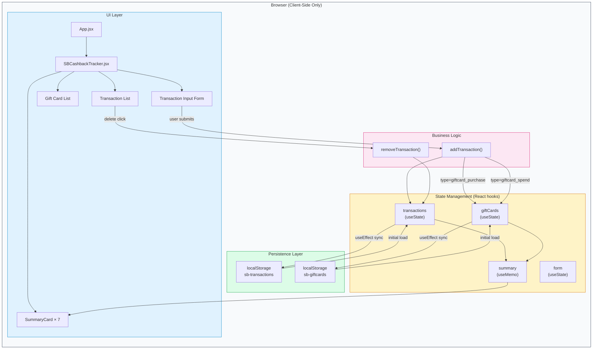
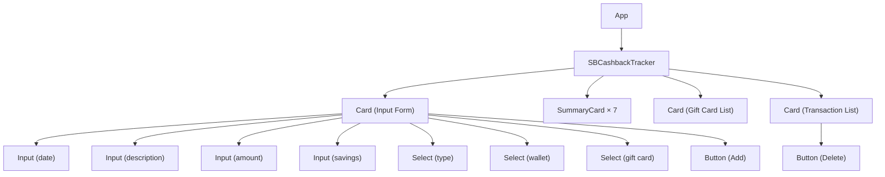
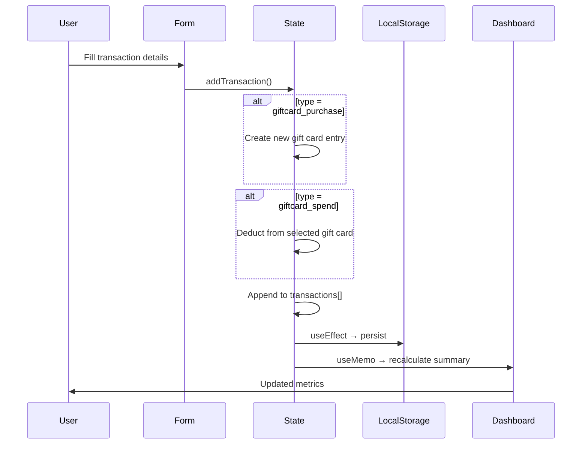

# SB Credit Card & Gift Card Tracker — Architecture

## What It Does

A personal finance tracker for managing credit card spending, gift card balances (Amazon/Flipkart), and cashback estimates. All data persists in the browser via `localStorage`.

### Core Flows

1. **Card Spend** — Log a direct credit card purchase with optional savings/discount amount
2. **Buy Gift Card** — Purchase a gift card (Amazon/Flipkart) using the credit card. Creates a trackable gift card with a balance.
3. **Spend Gift Card** — Use an existing gift card for a purchase. Deducts from the selected card's remaining balance.

### Dashboard Metrics

| Metric | Calculation |
|---|---|
| SB Card Utilized | Sum of all card + gift card purchase amounts |
| Amazon Gift Left | Sum of remaining balance on Amazon gift cards |
| Flipkart Gift Left | Sum of remaining balance on Flipkart gift cards |
| Total Gift Cards Left | All remaining gift card balances combined |
| This Month Spend | All transactions in the current calendar month |
| Est. Cashback | 1% of total card utilization |
| You Saved (Offers) | Sum of all savings/discount fields |

---

## Architecture Diagram



---

## Component Tree



---

## Data Flow



---

## File Structure

```
src/
├── main.jsx                          # Entry point
├── App.jsx                           # Root component
├── index.css                         # Tailwind CSS + theme tokens
├── components/
│   ├── SBCashbackTracker.jsx         # Main tracker (all logic + UI)
│   └── ui/
│       ├── button.jsx                # Button (shadcn-style)
│       ├── card.jsx                  # Card + CardContent
│       ├── input.jsx                 # Input
│       └── select.jsx               # Select (Radix UI based)
└── lib/
    └── utils.js                      # cn() utility (clsx + tailwind-merge)
```

## Tech Stack

| Layer | Technology |
|---|---|
| Framework | React 19 (Vite) |
| Styling | Tailwind CSS v4 |
| UI Components | shadcn/ui pattern (Radix UI primitives) |
| Animation | Framer Motion |
| Icons | Lucide React |
| Persistence | Browser localStorage |
| Build | Vite 7 |
